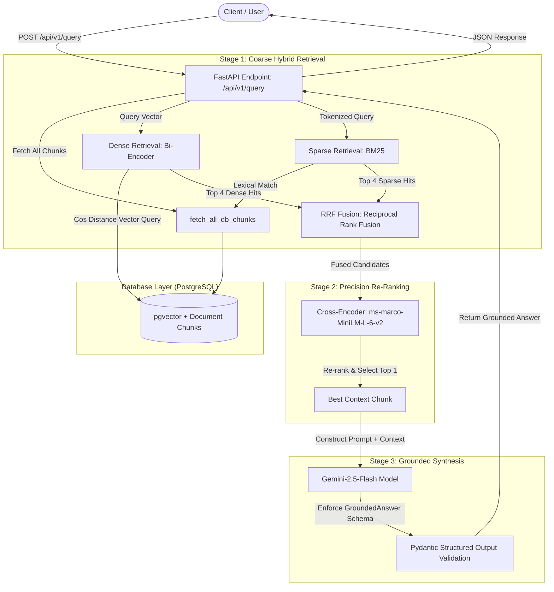

# Hybrid RAG Engine: Two-Stage Funnel with pgvector, BM25 & Cross-Encoder

A production-grade, deterministic Retrieval-Augmented Generation (RAG) backend engineered from scratch in Python and PostgreSQL.

This repository implements the standard two-stage retrieval funnel used in enterprise search systems. It intentionally skips high-level abstractions to maintain direct control over vector math, index construction, rank blending, and model inference.

---

## The Problem: Why Naive RAG Fails in Production

1. Semantic Fragmentation (Blind Chunking): Splitting by fixed word or character counts slices text midway through clauses.
2. The Identifier Blindspot (Dense-Only Search): Embedding models miss exact statutory identifiers, sections, and error codes.
3. Information Loss (Bi-Encoder Limits): Bi-encoders evaluate query and document independently, missing fine-grained token-level interactions.

---

## Architecture Overview

1. Sentence-Boundary Chunking: Splits text using regex on sentence boundaries to preserve intact regulatory clauses.
2. Stage 1 (Hybrid Search & RRF): Parallel execution of pgvector HNSW dense search and Okapi BM25 sparse search merged via Reciprocal Rank Fusion (k=60).
3. Stage 2 (Cross-Encoder Re-Ranking): Candidate pairs scored through cross-encoder/ms-marco-MiniLM-L-6-v2 for precision re-ranking.
4. Stage 3 (Grounded Synthesis): Direct prompt injection into Gemini 2.5 Flash enforced via Pydantic response schemas.

---

## System Architecture Diagram


---

## Tech Stack

```text
- Language: Python 3.10+
- Database: PostgreSQL 16 + pgvector
- Embedding Model: sentence-transformers/all-MiniLM-L6-v2 (384-d)
- Re-Ranker Model: cross-encoder/ms-marco-MiniLM-L-6-v2
- Lexical Search: rank-bm25
- LLM Engine: Gemini API (gemini-2.5-flash) via google-genai
- API Framework: FastAPI, Uvicorn, Pydantic v2
```

---

## Database Schema

```text
CREATE EXTENSION IF NOT EXISTS vector;

CREATE TABLE document_chunks (
    id SERIAL PRIMARY KEY,
    document_name TEXT NOT NULL,
    chunk_index INT NOT NULL,
    content TEXT NOT NULL,
    embedding vector(384),
    created_at TIMESTAMP WITH TIME ZONE DEFAULT CURRENT_TIMESTAMP
);

CREATE INDEX IF NOT EXISTS document_chunks_embedding_hnsw_idx 
ON document_chunks USING hnsw (embedding vector_cosine_ops)
WITH (m = 16, ef_construction = 64);
```

---

## Project Structure

```text
.
├── app.py              # FastAPI application with complete two-stage pipeline & Gemini
├── pipeline.py         # End-to-end local test pipeline (ingest, retrieve, rerank)
├── init_db.py          # PostgreSQL schema migration & HNSW index builder
├── .env                # Secrets management (GEMINI_API_KEY, DATABASE_URL)
├── requirements.txt    # Pinned production dependencies
├── .gitignore          # Environment and model cache exclusions
└── README.md           # Architecture documentation
```

---

## Quick Start

```text
1. Run PostgreSQL with pgvector:
   docker run -d --name ai_engineer_pgvector -p 5432:5432 -e POSTGRES_USER=ai_user -e POSTGRES_PASSWORD=ai_password -e POSTGRES_DB=rag_engine pgvector/pgvector:pg16

2. Install dependencies:
   pip install -r requirements.txt

3. Initialize database & seed vectors:
   python init_db.py
   python pipeline.py

4. Launch API server:
   uvicorn app:app --reload --port 8000
```
